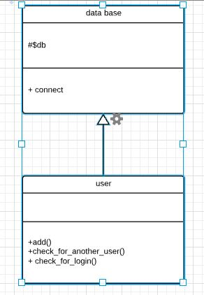

# intcore-internship-
## this is related to intcore internship web development first task
### It's simple registergtion system it can be described and modeled using following diagrams:

#### context diagram:

##### this shows the components of system

#### sequence diagram:

#####  this shows a particular event (interaction with user)

#### class diagram

#####  this shows class attributes,methods,inheritance,...which are used to build system

## this a video to system its link:<a href="https://youtu.be/eD7RPDjcKE0">click here</a>
